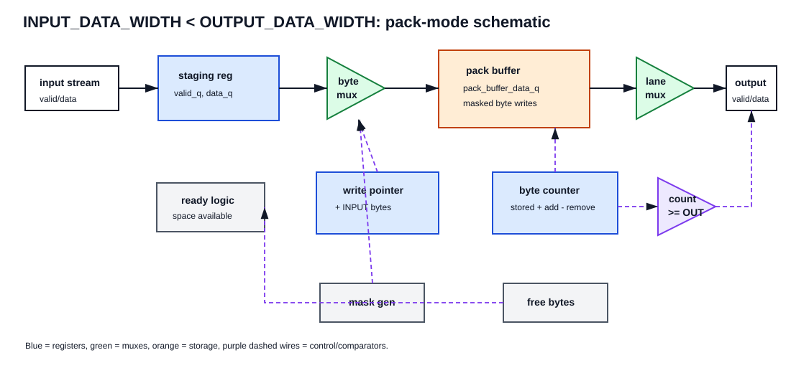
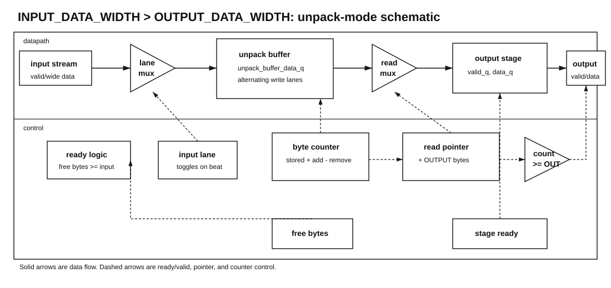

# Gearbox Circuit Diagrams

These schematic-style diagrams show the two main datapath structures used by
the gearbox. They are hand-drawn documentation diagrams, not generated netlists.

## Input Width Smaller Than Output Width

When `INPUT_DATA_WIDTH < OUTPUT_DATA_WIDTH`, the gearbox packs multiple smaller
input beats into a circular buffer. `output_stream_valid` asserts after enough
bytes are stored to produce one complete wider output beat.

Key ideas:

- input beats are first captured in an input staging register
- a write pointer selects which buffer bytes are updated
- a stored-byte counter tracks when a complete output beat is available
- output data is selected from the lower or upper output lane

## Input Width Larger Than Output Width

When `INPUT_DATA_WIDTH > OUTPUT_DATA_WIDTH`, the gearbox stores each wider input
beat in an unpack buffer. A read pointer selects narrower output beats from the
buffer and feeds an output stage that can hold data during backpressure.

Key ideas:

- input beats are written into alternating buffer lanes
- a stored-byte counter tracks available output bytes
- a read pointer selects the next output beat
- the output stage keeps `output_stream_data` stable while downstream
  backpressure is applied
